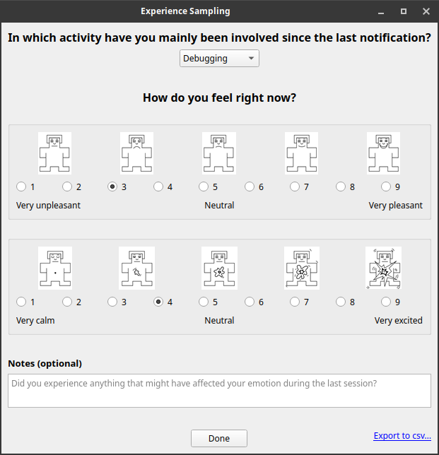
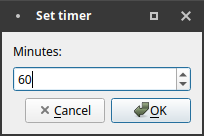
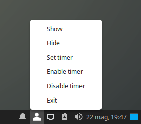
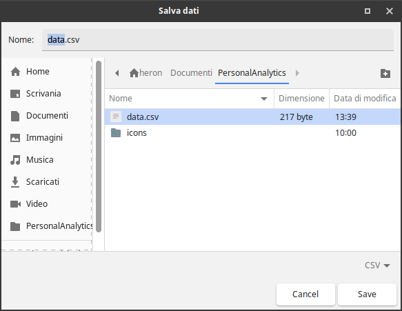

# Personal Analytics
*Submission per l'Emotions Contest, Uniba*

L'applicazione di **experience sampling** mostra la sua finestra principale ogni 60 minuti (di default). Quando la finestra viene chiusa, l'applicazione rimane in esecuzione nella system tray. Dalla system tray è possibile in ogni momento richiamare la finestra, uscire dal programma e abilitare, disabilitare e impostare il timer.

I dati inseriti (insieme con il timestamp di apertura della finestra e il timestamp di invio del form) vengono salvati in file CSV che è possibile copiare in un'altra directory direttamente dall'applicazione.

L'applicazione è scritta in Python 3, dipende unicamente dalle librerie Qt5 ed è, pertanto, **multipiattaforma**. Tutte le icone provengono dal repository https://github.com/collab-uniba/PersonalAnalytics/tree/field_study_merge

Esempio di file csv:
```
1558525912,1558525917,Coding,7,6,
1558525925,1558525931,Taking a break,6,8,I'm going to lunch.
1558525947,1558525958,Debugging,3,4,
```









