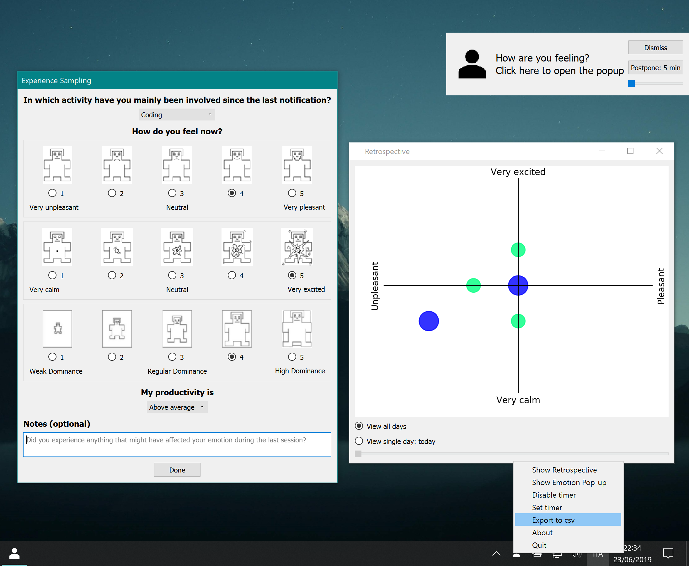

# ExperienceSampling

[EN version](https://github.com/h3r0n/ExperienceSampling/blob/master/README_EN.md)

L'applicazione mostra una notifica ogni 60 minuti (di default). Cliccando sulla notifica è possibile accedere ad un form in cui l'utente può inserire le emozioni riportate durante la giornata.

Quando la finestra viene chiusa, l'applicazione rimane in attesa nella system tray.

I dati inseriti (insieme con il timestamp di apertura della finestra e il timestamp di invio del form) vengono salvati in un database che è possibile esportare in formato CSV. Se fornito un file [credentials.json](https://gspread.readthedocs.io/en/latest/oauth2.html) nella cartella `data`, i dati raccolti vengono caricati su Google Spreadheets. Per poter essere visualizzati, è necessario condividere gli spreadsheet con degli account Google. Scrivere una lista degli indirizzi email di tali account nel file `data/sharelist.txt` (uno per riga, senza a capo finale).

È presente un'opzione per mostrare una retrospettiva in forma di diagramma a bolle in accordo con il Circumplex Model di James Russell.

L'applicazione è scritta in Python 3 e Qt5, dipende unicamente da librerie **multipiattaforma**. È stata testata su Windows e Linux. Tutte le icone provengono dal repository https://github.com/collab-uniba/PersonalAnalytics/tree/field_study_merge

Esempio di file csv:
```
1560297165,,,,POPUP_OPENED,
1560297173,Coding,7,6,POPUP_CLOSED,
1560297178,,,,POPUP_OPENED,
1560297190,Taking a break,6,8,POPUP_CLOSED,I'm going to lunch.
1560297194,,,,POPUP_OPENED,
1560297219,Debugging,3,4,POPUP_CLOSED,I can't fix a bug!
```



# Generazione eseguibile standalone

La lista delle dipendenze è contenuta nel file `requirements.txt`. È possibile installarle con il comando `make develop`.

Per generare un eseguibile standalone per Linux, eseguire `make build` in un ambiente Linux. In Windows eseguire `make build` per generare un file exe. Allo stesso modo eseguire `make build` in Mac OS per generare un file app.
Gli eseguibili vengono generati nella cartella `dist`.

Prima di ogni nuova build, eseguire `make clean` per rimuovere la cartella `build` generata durante le build precedenti.
